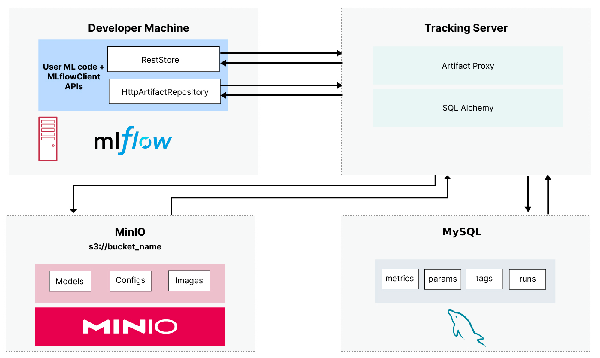

# MLFLOW self hosted deployment 

## Overview 
This project contains the necessary docker files and compose to deploy an mlflow server. 
In this deployment, MinIO S3 is used to store the artifacts and Mysql is used as the backend store. 

## Architecture

<div style="text-align:center;">

</div>

## Pre-Requisites
- [Docker](https://www.docker.com/) is installed and running.
- [Conda](https://www.anaconda.com/)(Optional) is installed.

## Setup 
1. Clone the repository:

    ```bash
    git clone https://github.com/Mcamin/mlflow-selfhosted.git  && cd mlflow-selfhosted
    ```
2. Rename or copy [.env.default](.env.default) to [.env](.env).  
3. Build and run the containers with docker-compose
   ```bash
   docker-compose --env-file .env up -d --build
   ```
4. Open the [MinIO console](http://localhost:9001), create a bucket and an access key. 
5. Copy the access key details into the [.env](.env) file.
6. Restart the deployment
      ```bash
   docker-compose down && docker-compose --env-file .env up -d 
   ```

## Service urls
- Mlflow UI: http://localhost:5000
- MinIO UI: http://localhost:9001

## Test Deployment
To test the deployment you can do the following: 
1. Setup a new conda environment and install mlflow 
   ```bash
   conda create -n mlflow_env python=3.10 && conda activate mlflow_env && pip install mlflow && pip install boto3
   ```
2. Set the necessary environment variables
   ```bash 
   # Linux 
   export MLFLOW_TRACKING_URI=http://127.0.0.1:5000
   export MLFLOW_S3_ENDPOINT_URL=http://127.0.0.1:9000
   # Windows 
   set MLFLOW_TRACKING_URI=http://127.0.0.1:5000
   set MLFLOW_S3_ENDPOINT_URL=http://127.0.0.1:9000
   ```
3. Set MinIO credentials (Warning: This will overwrite )
   ```bash
   # Linux
   cat <<EOF > ~/.aws/credentials
   [default]
   aws_access_key_id=minio
   aws_secret_access_key=minio123
   EOF
   ```
   ```bash
   # Windows 
   (
   echo [default]
   echo aws_access_key_id=youraccesskey
   echo aws_secret_access_key=yoursecretkey
   ) > %UserProfile%\.aws\credentials
   ```
4. Train a simple model from the mlflow examples 
   ```bash
   mlflow run https://github.com/mlflow/mlflow-example.git -P alpha=0.42
   ```
5. Test serving the model (replace with your model's actual path)
   ```bash
   mlflow models serve -m S3://mlflow/0/3097ebc36c7c4eab92f6741fca3e88f8/artifacts/model --env-manager=local -p 1234
   ```
6. Test the deployed model with the following command 
   ```bash
   curl --location 'http://127.0.0.1:1234/invocations' \
   --header 'Content-Type: application/json' \
   --data '{"dataframe_split":{
   "columns":["fixed acidity", "volatile acidity", "citric acid", "residual sugar", "chlorides", "free sulfur dioxide", "total sulfur dioxide", "density", "pH", "sulphates", "alcohol"],
   "data":[[6.2, 0.66, 0.48, 1.2, 0.029, 29, 75, 0.9892, 3.33, 0.39, 12.8]]
   }
   }'  
   ```


## References 
- https://blog.min.io/setting-up-a-development-machine-with-mlflow-and-minio/
- https://mlflow.org/
- https://min.io/


